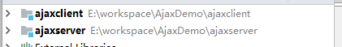
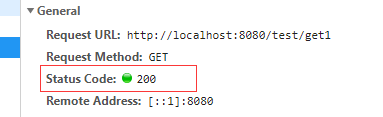
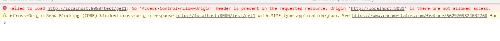
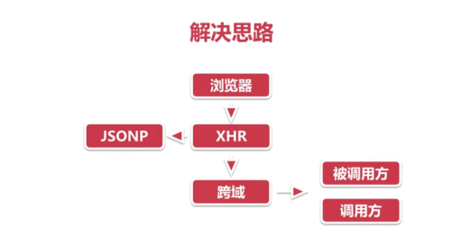

tags: 
    - ajax
    - 跨域
categories: 
    - javascript
---
#### 什么是ajax跨域问题
前台调用后台服务接口时，前后台不在一个域（协议、域名、端口）就会产生跨域问题。

#### 判断一个url是否跨域
| 当前url   |      被请求url      |  是否跨越 |  原因
|----------|:-------------:|------:|------:|
| `http://www.test.com/` |  `http://www.test.com/index.html` | 否 | 同源（协议、域名、端口号相同）
| `http://www.test.com/` |  `https://www.test.com/index.html`| 跨域 |协议不同
| `http://www.test.com/` |  `http://www.baidu.com`/| 跨域 |主域名不同
| `http://www.test.com/` |  `http://blog.test.com`/| 跨域 |子域名不同
| `http://www.test.com:8080/` |  `http://www.test.com:7001`/|跨越|端口号不同

#### 编写测试代码
1. 新建项目ajaxclient、ajaxserver
    
2. ajaxserver编写api
   1. Controller
   
    ``` 
        @RestController
        @RequestMapping("/test")
        public class TestController {
            @GetMapping("get1")
            public RequestBean get1(){
                System.out.println("TestController.get1");
                return new RequestBean("get1 ok");
            }
        }
    ```
    
    2. Bean
    
    ```
        public class RequestBean {
            private String data;
            public RequestBean(String data) {
                this.data = data;
            }
            public String getData() {
                return data;
            }
            public void setData(String data) {
                this.data = data;
            }
        }
    ```
3. ajaxclient前台代码

```
    <!DOCTYPE html>
    <html lang="en">
    <head>
        <meta charset="UTF-8">
        <title>Title</title>
        <script src="https://code.jquery.com/jquery-3.4.1.min.js"></script>
    </head>
    <body>
        <a href="#" onclick="get1()">发送get1请求</a>
        
        <script>
            function get1() {
    
                $.getJSON("http://localhost:8080/test/get1").then(
                    function (result) {
                        console.log(result);
                    }
                )
            }
        </script>
    </body>
    </html>
```
> 注：8080端口已经被ajaxserver占用，这里要更改ajaxclient端口号

#### 测试结果：跨域问题产生
1. 服务端返回200

2. 浏览器控制台报错


> 引入前台Jasmine测试框架（https://jasmine.github.io/）

#### 为什么会发生ajax跨域（三个条件同时满足）
1. 浏览器限制
    * 浏览器出于安全考虑，发现请求跨域，会做一些校验，校验不通过就会报错
    * 测试请求，后台正常接收请求，也已经正常处理，只是浏览器报错
    
2. 跨域
    * 调用方和被调用方不处在同一个域（协议、域名、端口号有一个不同就是不同域）

3. XHR (XmlHttpRequest)请求
    * 发送的请求类型是XHR
    
#### 解决跨域问题思路

针对发生跨域问题产生的原因来解决（上文所述三个条件）

* 针对浏览器限制：添加参数，让浏览器不限制，不做校验
    * 意义不大，浏览器是客户端的，每个人都要改动
* 针对请求XHR请求：发送的请求类型只要不是XHR就不会有跨域问题，
使用jsonp请求

* **针对跨域**(重点)：基于jsonp有很多弊端，无法满足现在的开发要求，jsonp使用的越来越少
    * 方式一 ：
        （支持跨域）被调用方修改代码支持跨域，基于http协议关于跨域方面的要求做的修改，
        a域名访问b域名，b域名返回信息告诉浏览器自己支持跨域
        
    * 方式二：
        （隐藏跨域）被调用方不是本地、本公司，无法进行代码修改，从而实现方式一的目的，就要调用方修改代码，通过一个代理，
        从浏览器发出去的都是a域名请求，在代理里面把请求转换为b域名

#### 浏览器禁止检查

命令行参数启动浏览器，禁止浏览器进行安全校验
    

